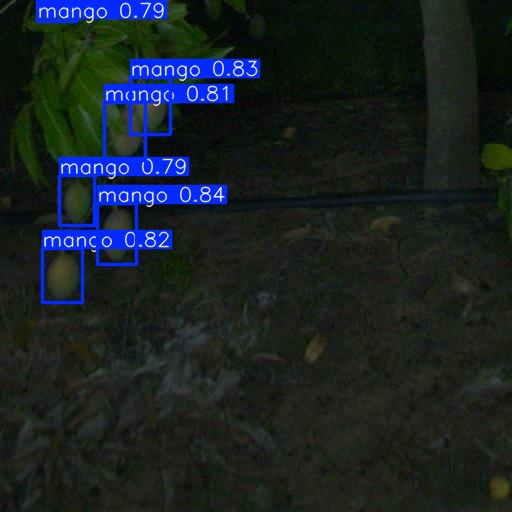
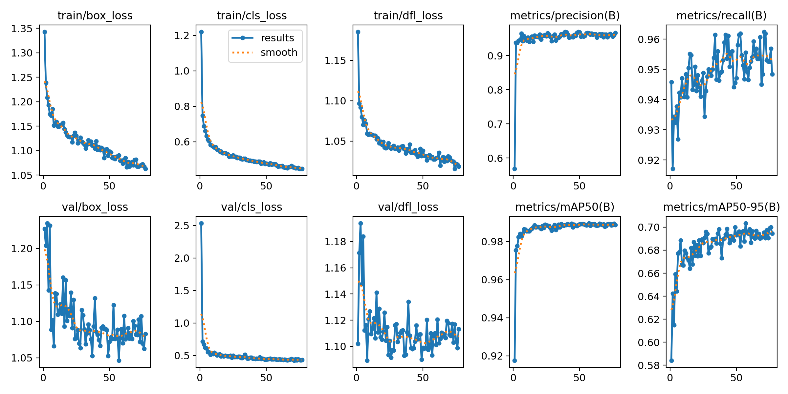
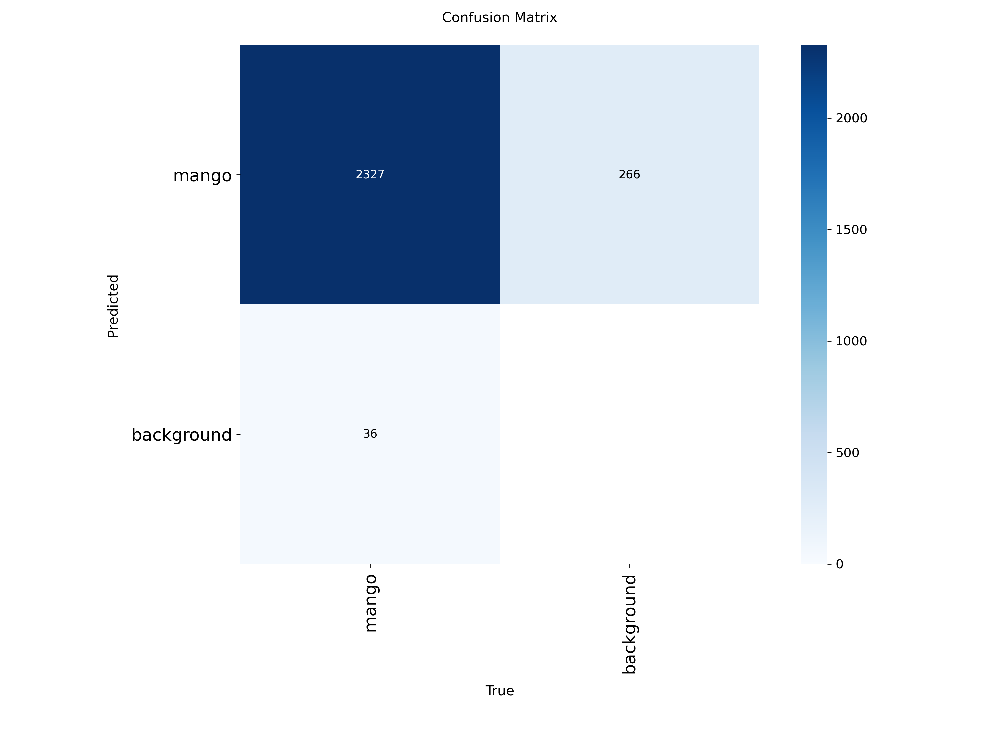
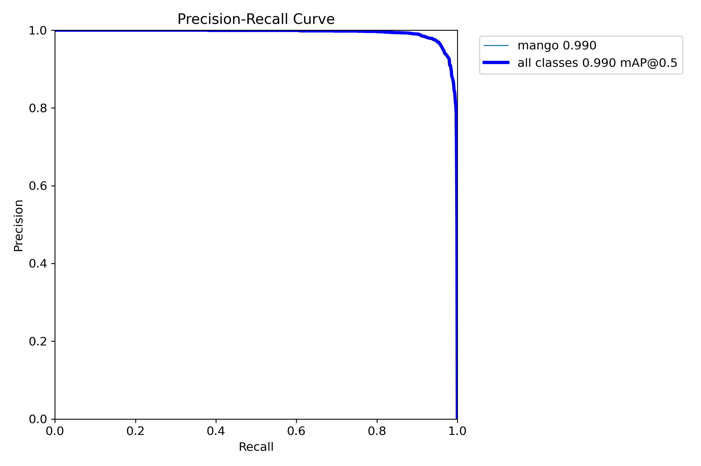
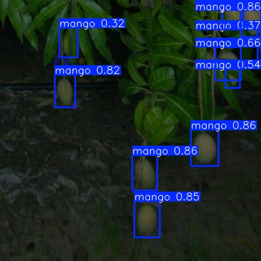
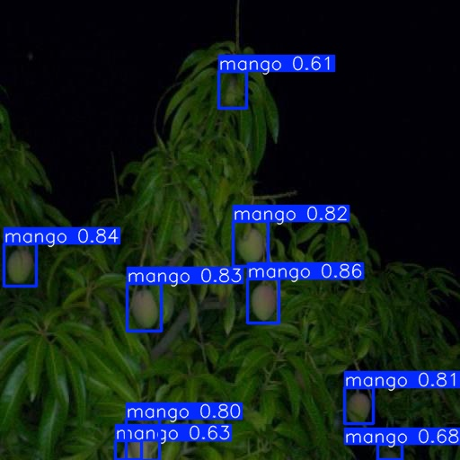

# YOLOv11 Mango Detection

A computer-vision project that fine-tunes **YOLOv11-n** to detect mangoes in orchard images. The repository provides the training and evaluation notebook, recorded metrics, graphs, sample predictions, dataset attribution, checkpoint-download instructions and a configurable inference script.

**Technical case study:** [View the portfolio case study](https://jeraldbucud.com/yolov11-mango-detection-case-study.html)

<p align="center">
  
</p>

## Project highlights

- Single-class object detection: `mango`
- Fine-tuned YOLOv11-n from pretrained weights
- Baseline and tuned training configurations
- Validation-based model selection
- Final evaluation on a held-out test split
- Configurable command-line inference script
- Dataset, model and repository licensing documented

## Final test results

| Metric | Result |
|---|---:|
| Precision | 0.936436 |
| Recall | 0.971182 |
| mAP@0.5 | 0.989359 |
| mAP@0.5:0.95 | 0.704345 |
| Test images | 86 |
| Test instances | 694 |

The tuned checkpoint was selected using validation performance before the held-out test split was evaluated.

## Experiment comparison

| Experiment | Purpose | Epochs | Learning rate | mAP@0.5 | mAP@0.5:0.95 | Precision | Recall |
|---|---|---:|---:|---:|---:|---:|---:|
| Experiment 1 | Baseline | 50 | 0.0010 | 0.988831 | 0.701359 | 0.962133 | 0.951333 |
| Experiment 2 | Tuned | 100 planned; stopped at 77 | 0.0008 | 0.990000 | 0.703000 | 0.966000 | 0.956000 |

Experiment 2 reached its best recorded epoch at epoch 57 and was selected as the final model.

## Dataset

The project uses a single-class mango-detection dataset with YOLO bounding-box annotations.

| Split | Images |
|---|---:|
| Training | 1,384 |
| Validation | 260 |
| Test | 86 |
| **Total** | **1,730** |

Dataset source:

- Roboflow Universe: `weed-mapping/mango-detection-glzls`
- Licence: **CC BY 4.0**
- Source page: https://universe.roboflow.com/weed-mapping/mango-detection-glzls

The complete dataset is not committed to this repository. See [`data/README.md`](data/README.md) for setup and attribution instructions.

## Checkpoint access

The trained checkpoint is not stored directly in the repository. Download it using the link in [`models/MODEL_CARD.md`](models/MODEL_CARD.md), then place it at:

```text
models/best.pt
```

The checkpoint is required for inference and evaluation.

## Repository structure

```text
yolov11-mango-detection/
├── README.md
├── LICENSE
├── NOTICE.md
├── CITATION.cff
├── requirements.txt
├── config/
│   └── data.yaml
├── data/
│   ├── README.md
│   └── samples/
├── docs/
│   └── README.md
├── models/
│   └── MODEL_CARD.md
├── notebooks/
│   └── yolov11_mango_detection.ipynb
├── results/
│   ├── graphs/
│   ├── metrics/
│   └── predictions/
└── src/
    └── predict.py
```

## Open in Google Colab

[](https://colab.research.google.com/github/JeraldBucud/yolov11-mango-detection/blob/main/notebooks/yolov11_mango_detection.ipynb)

Before running dataset-dependent cells:

1. Download the dataset separately.
2. Set `MANGO_DATASET_DIR` in the notebook or as an environment variable.
3. Download the selected checkpoint and place it at `models/best.pt` when running evaluation or inference.

## Local installation

```bash
git clone https://github.com/JeraldBucud/yolov11-mango-detection.git
cd yolov11-mango-detection
python -m venv .venv
```

Activate the environment:

```bash
# Windows PowerShell
.venv\Scripts\Activate.ps1

# macOS/Linux
source .venv/bin/activate
```

Install dependencies:

```bash
pip install -r requirements.txt
```

## Run inference

Predict on one image:

```bash
python src/predict.py --source path/to/mango_image.jpg
```

Predict on a folder:

```bash
python src/predict.py --source path/to/images --conf 0.25
```

By default, the script uses `models/best.pt` and saves annotated outputs under `runs/predict/`. Use `--help` to review the available source, weights, output, confidence, IoU and image-size options.

## Training configuration

| Setting | Value |
|---|---|
| Model | YOLOv11-n |
| Input size | 640 × 640 |
| Batch size | 16 |
| Optimiser | AdamW |
| Initial learning rate | 0.0008 |
| Planned epochs | 100 |
| Early stopping | Stopped at epoch 77 |
| Best recorded epoch | 57 |
| Class | mango |

The recorded training environment used Ultralytics 8.4.52, Python 3.12.13, PyTorch 2.10.0 with CUDA and a Tesla T4 GPU. Hardware and package differences can change runtime and results.

## Results

### Training history



### Confusion matrix



### Precision-recall curve



### Prediction examples

| Example 1 | Example 2 | Example 3 |
|---|---|---|
|  |  |  |

## Current limitations

- The dataset represents a limited range of orchards and capture conditions.
- Occluded, clustered, small and poorly illuminated mangoes remain challenging.
- The model detects one class and does not assess ripeness, variety, disease or fruit quality.
- Results were measured on one held-out test split; external orchard validation has not yet been completed.
- Inference speed and resource use have not yet been benchmarked on a defined target device.

## Next steps

- Test images from additional orchards, cultivars, seasons and lighting conditions.
- Compare YOLOv11-n with larger YOLOv11 variants.
- Evaluate image-level counting and fruit-load estimation against annotated ground truth.
- Build an image-upload demonstration.
- Benchmark latency, memory and throughput on realistic hardware.

## References

- Koirala, A., Walsh, K. B., Wang, Z., & McCarthy, C. (2019). *Deep learning for real-time fruit detection and orchard fruit load estimation: Benchmarking of MangoYOLO*. Precision Agriculture, 20, 1107–1135. https://doi.org/10.1007/s11119-019-09642-0
- Redmon, J., Divvala, S., Girshick, R., & Farhadi, A. (2016). *You Only Look Once: Unified, Real-Time Object Detection*. CVPR.
- Ultralytics. *Ultralytics YOLO documentation*. https://docs.ultralytics.com/

## Author

**Jerald Christopher Bucud**

This project began as academic computer-vision work. The public repository contains the cleaned implementation, documented results and licensing information, while personal student information and assessment-only material are excluded.
